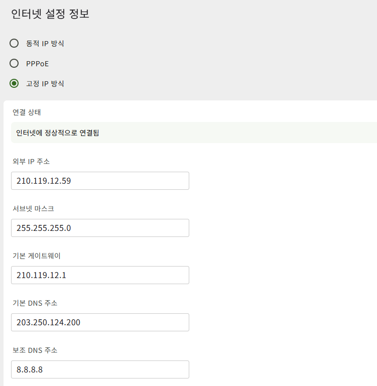
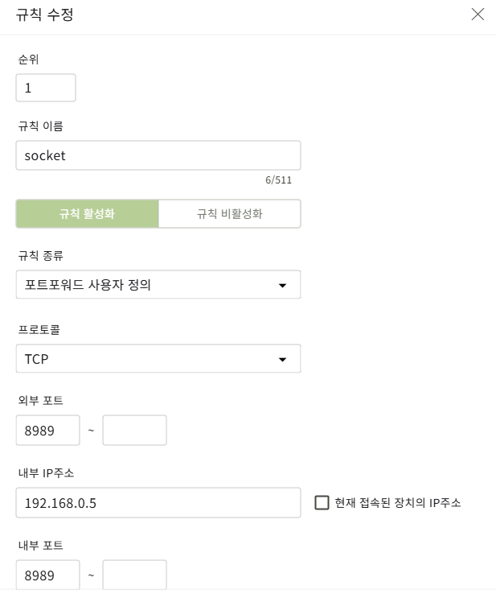

# iot-TCP-IP-Socket-2026
IoT 개발자 과정 TCP/IP 소켓프로그래밍 리포지토리

# 2026-04-17

## vmware 설치

## Ubuntu 설치

## Socket 통신
- 소켓통신은 이더넷 기반 실시간 데이터 전송방식인 TCP 또는 UDP를 사용하는 양방향 통신이다.
- 데이터를 요청하는 클라이언트와 데이터를 제공하는 서버의 주체가 필요하다.
- 네트워크는 Net + Work의 합성어로 두 대의 기기를 연결하고 서로 통신할 수 있는것
- 소켓은 전송계층과 응용프로그램 사이의 인터페이스 역할을 하며 떨어져 있는 두 호스트를 연결해준다.
- IP는 데이터를 정해진 목적지까지 전달만 하는 역할이며 비신뢰성과 비연결성의 특징을 가지고 있다. 따라서 온전한 데이터의 전달은 보장하지 않는다.
- 프로토콜은 컴퓨터간 원거리 통신 장비 사이에서 메시지를 주고 받는 수 있는 양식과 규칙의 체계이다.
- TCP는 데이터를 온전하게 받을 수 있도록 도와주는 프로토콜이다.
- HTTP는 웹 브라우저와 웹 서버 간에 데이터를 주고 받기 위한 프로토콜이다.

# 직렬통신
- 데이터가 한줄로 순서대로 날라가는것

# 병렬통신
- 8비트의 병렬통신을 한다고 하면, 8개의 비트 데이터가 한꺼번에 날라가는것
- 대신 데이터 수만큼의 선이 필요하므로 설비가 많이 필요하다.

# 양방향 통신(휴대폰 전화)
- 데이터를 받는 와중에 전송도 동시에 가능한 것 

# 단방향 통신(무전기)
- 데이터를 받을때는 받기만하고, 데이터를 전송할때는 전송만 가능하다.

# TCP
- 데이터를 완전히 다 보낼수 있는 것. 신뢰성 100%

# UDP
- 데이터가 중간에 소실될수있다. 그래서 중간에 데이터가 한두개정도 소실되도 별로 상관없다하는 것들을 보낼때 이것을 쓴다. 

## https://dawntea-studio.tistory.com/entry/C-%EC%A0%80%EC%88%98%EC%A4%80-%ED%8C%8C%EC%9D%BC-%EC%9E%85%EC%B6%9C%EB%A0%A5-open-close-write-read

# 우분투를 설치했으면
- 터미널 창을 켜도 `sudo apt update`를 해서 업데이트를 해준다.
- sudo apt upgrade, sudo apt install terminator

# 리눅스 명령어
- pwd: 현재 내가 있는 폴더의 위치
- cd : 이동 
- ~ : 사용자 디렉토리
- cd / : 현재 내가 있는 폴더의 위치를 루트로 지정한다. 실제로 이렇게 한 상태로 pwd를 하면 폴더의 주소가 다르게 나온다.
- ls : 현재 폴더내에 있는 파일들을 확인
- ls -l : 위의 명령어를 더 자세히 볼때
- ls -a : 보이지 않는 파일들까지 싹 다 나온다.
- ls -al : 위의 명령어를 더 자세히 볼때
- clear : 화면 지움
- ip a : ip확인 
- mkdir + 디렉토리명(폴더명): 새로운 디렉토리를 만든다.
- . : 현재 위치
- .. : 상위 디렉토리 위치
- rm + 파일명 : 파일을 삭제
- rm -fr + 폴더명: 폴더안에 하위 폴더나 파일이 있으면 삭제가 되지 않는다. 이때 이 명령어를 사용하면 안에 있는 파일과 폴더들과 함께 싹 다 삭제된다. 
- sudo : 명령어 앞에 sudo를 붙이면 관리자 권한으로 열겠다는 뜻
- nano hello.c : hello.c라는 파일이 있으면 그 파일을 편집모드로 들어가겠다는 뜻. 파일이 없으면 만들어줌
- gcc hello.c -o hello : hello.c 파일을 컴파일하여서 hello라는 이름의 실행파일을 만들겠다는 뜻
- ./hello : 이 폴더안에 있는 hello라는 실행파일을 실행하겠다는 뜻
- chmod u+x hello.c : hello.c라는 파일을 실행도 할수있게 권한을 줘라 라는 뜻. (u+r 은 읽기 권한을 줘라) (u+w 는 쓰기 권한을 줘라)
- chmod u-x hello.c : hello.c라는 파일을 실행할수없게 권한을 없애라 라는 뜻.
- ps au : 가동중인 프로세스 전체를 볼 수 있음

# ls -al
- ls -al  명령어를 실행했을때, 파일앞에 적혀있는 rwx이런식으로 되어있는데, 이것은 읽고 쓰기가 가능하며, 실행까지 가능하다는 뜻
- rw- 는 읽고 쓰기는 가능하다 실행을 불가능하다는 뜻 

# #include <fcntl.h>
    - int open(const char* name, int flags)
    - O_RDONLY, O_WRONLY, O_RDWR, O_AAAEND, O_CREAT
 

 ## 2026-04-20

 - 이 날 휴가썼다. 알아서 공부하던가 팀원들한테 물어라

# 현빈씨 공부한거 받았다.
 - https://github.com/gusqls7748/iot-socket-2026   

    - [코드- 클라이언트](./260420/3_base_client.c)
    - [코드- 서버](./260420/3_base_server.c)

 ## 2026-04-21

    - [코드- 클라이언트](./260421/3_echo_client.c)
    - [코드- 서버](./260421/3_echo_server.c)

 # TCP는 연결지향형이라 정확한 데이터가 전송되어지고
 # UDP는 비연결지향형이라 데이터 손실을 감수해야한다. 
 -  TCP는 1대1의 연결이 필요로 하지만, UDP는 연결의 개념이 존재하지 않는다.
 - 따라서 서버 소켓과 클라이언트 소켓의 구분이 없다.
 - 연결의 개념이 존재하지 않으므로 하나의 소켓으로 둘 이상의 영역과 데이터 송수신이 가능하다.
 - 메시지를 줄때마다 소켓? 라인?을 새롭게 계속 생성한다.
 - udp 소켓은 연결의 개념이 있지 않으므로 데이터를 전송할때마다 목적지에 대한 정보를 전달해야한다.
 - udp 소켓은 연결의 개념이 있지 않으므로 데이터의 전송지가 둘 이상이 될 수 있다. 따라서 데이터 수신 후 전송지가 어디인지 확인할 필요가 있다.

 # Half-close 기법
 - 종료를 원한다는 것은, 더이상 전송할 데이터가 존재하지 않는 상황이다.
 - 따라서 출력 스트림은 종료를 시켜도 된다.
 - 다만 상대방도 종료를 원하는지 확인되지 않은 상황이므로, 출력 스트림은 종료시키지 않을 필요가 있다.
 - 때문에 일반적으로 Half-close라 하면, 입력 스트림만 종료하는 것을 의미한다.
 - Half-close를 가리켜 '우아한 종료'라고도 한다. 
    - Shut-down 함수
        - SHUT_RD : 입력 스트림 종료
        - SHUT_WR : 출력 스트림 종료
        - SHUT_RDWR : 입출력 스트림 종료

# 공유기 변경 및 연결
브라우저에 192.168.0.1로 접속
예성 pknu59,  
외부 ip: 210.119.12.59, 
서브넷마스크: 255.255.255.0, 
게이트웨이 210.119.12.1, 
기본DNS : 203.250.124.200, 
보조DNS: 8.8.8.8, 
와이파이 이름: pknu_59, 
비밀번호 : *pknu59*

- 포트포워드 사진에서 보면 내부ip는 내가 서버를 켤때 다들 접속해야할 실제 내 ip주소를 말하는거같고, 인터넷설정정보의 외부ip는 상대가 접속할때 저기로 접속해야 내 내부ip로 접속할수있는거같다. 한마디로 내부ip는 가리고 외부ip로 접속해서 들어오게하려는것인듯?

# 2026-04-22
## 다중접속서버
1. 멀티프로세스 기반 서버
   - 다수의 프로세스를 생성하는 방식
   - 프로세스는 실행중인  프로그램을 말한다.
   - 프로세서를 생성하기 위해 부모 프로세서(main 함수)는 fork()함수를 호출하여 자식 프로세서를 생성한다.
   - fork()함수를 사용하기 위해서는 <unistd.h> 파일을 추가해야한다.
   - pid_t pid = fork(void);   => 성공시 프로세서ID, 실패시 -1 반환
   - `좀비 프로세서` : 원래 프로세서는 main함수가 반환되면 소멸되어야한다. 그러나 실행이 완료되었지만 소멸되지 않고 리소스를 차지하는 프로세서이다.
      - 생성원인 : 자식프로세서가 종료되면서 반환하는 상태 값이 부모 프로세서에게 전달되지 않으면 해당 프로세스는 소멸되지 않고 좀비가 된다. 자식 프로세서의 종료 상태 값은 먼저 운영체제에 전달되는데 인자를 전달하면서 exit을 호출하는 경우나 main함수에서 return문을 실행하면서 값을 반환하는 경웨 운영체제에 전달된다. 하지만 자식 프로세스가 종료되었는데도 이를 기다리고 있는 부모프로세서가 없는 경우 좀비 프로세스가 된다.
      - 예방 방법 : `wait함수`과 `waitid 함수`를 사용하여 좀비 프로세스를 예방한다.
         - pid_t wait(int* statloc);  => 성공 시 종료된 자식프로세서ID 실패 시 -1 반환. statloc : 종료상태를 담을 포인터, 받을 필요가 없다면 0을 입력한다.
         - 이 함수가 호출 되었을때 이미 종료된 자식이 있다면, 자식 프로세서가 종료되면서 전달한 

         - pid_t waitid(pid_t pid, int* statloc, int options);  => 성공 시 종료된 자식 프로세서id, 실패 시 -1 반환
            - pid : 종료 확인이 필요한 자식 프로세서 ID. -1을 전달하면 wait함수와 마찬가지로 종료를 기다린다.
            - statloc : 종료상태를 담을 포인터, 받을 필요가 없다면 0을 입력한다.
            - 
   `결론은 부모 프로세스가 먼저 종료되면 절대 안된다`

   - 시그널 : 시그널이란 운영체제가 어떤 특정한 상황을 프로세서에세 알리는 것으로, 자식프로세서의 종료를 운영체제로부터 전달받는다.
      - void* signal(int signo, void(*handler)(int)));  => 시그널 발생 시 호출되도록 이전에 등록된 함수의 포인터 반환
         - 시그널 핸들링 : 부모프로세서에게 자식 프로세서의 종료를 알림.
         - Signal함수는 유닉스계열 운영체제별로 동작 차이를 보임

   - 파이프:

2. 멀티플렉싱 기반 서버
   - 입출력 대상을 묶어서 관리하는 방식

3. 멀티스레딩 기반 서버
   - 클라이언트 수만큼 스레드를 생성하는 방식
   - 멀티프로세스보다는 멀티스레딩이 가볍기 때문에 더 많이 쓰인다.
   - 스위칭 속도가 빠르다.
   - 프로세서 내에서 실행되는 흐름으로 스레드간 데이터 공유가 쉽다.
   - 각 스레드별 스택 영역만 독립적이며 데이터와 힙 영역은 공유된다.
   - 하나의ㅏ 운영체제 내에선느 둘 이상의 프로세서가 생성되고, 하나의 프로세서 내에서는 둘 이상의 스레드가 생성된다.
   

# 2026-04-23

## 멀티스레드
1. 임계영역
   - 임계영역은 둘 이상의 스레드가 동시에 접근하여 실행하면 문제를 일으키는 영역이다.
   - 동기화가 필요한 상황 : 동일한 메모리 영역으로의 동시 접근이 발생하는 상황. 동일한 메모리 영역에 접근하는 스레드의 실행순서를 지정해야 하는 상황
   - `Mutex` : 뮤텍스 생성시에는 뮤텍스의 참조값 저장을 위한 변수의 주소 값 전달, 그리고 뮤텍스 소멸시에는 소멸하고자 하는 뮤텍스의 참조 값을 저장하고 있는 변수의 주소 값 전달
   - `attr` : 생성하는 뮤텍스의 특성정보를 담고 있는 변수의 주소 값 전달, 별도의 특성을 지정하지 않을 경우에는 NULL전달

   - `SEMAPHORE`

## 멀티플렉싱
- 멀티프로세서의 단점 : 프로세서의 빈번한 생성으로 성능저하가 발생하고 멀티 프로세서의 흐름 구현이 쉽지 않다. 또한 프로세서간 통신이 필요한 경우는 구현이 더 복잡해진다.
- 멀티프로세서의 해결책이 멀티플렉싱 =>하나의 프로세서로 다수의 클라이언트에게 서비스를 제공한다. 그러면 하나의 프로세서가 여러개의 소켓을 핸들링해야한다. 이것이 IO멀티 플렉싱이다.(하나의 프로세서가 서버 소켓 + 여러 클라이언트 소켓을 관리)